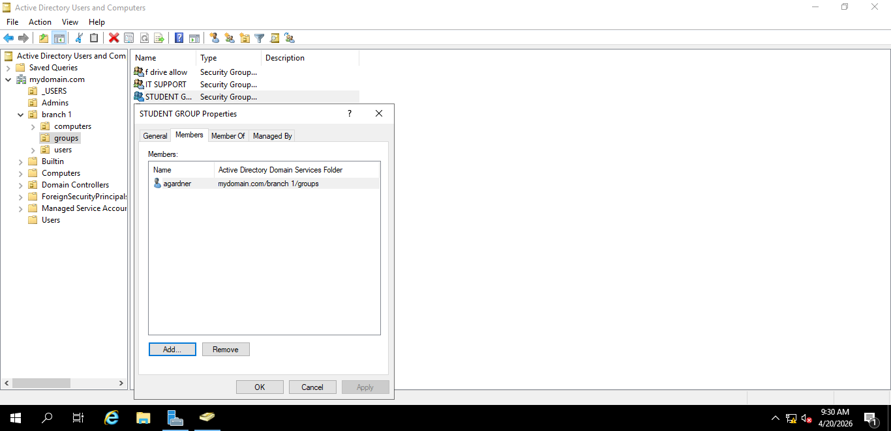

# 🖥️ IT Support Portfolio

## 👋 About Me
I am an aspiring IT Support Technician with hands-on experience in:

- Active Directory (AD)
- Windows Server Administration
- Cisco Networking Basics
- ServiceNow Ticketing System
- Hardware troubleshooting and repair

This portfolio demonstrates practical IT support skills in real-world scenarios.

---

## 🧠 Skills Demonstrated

- User account creation and management (Active Directory)
- Group policies and permissions
- Windows Server setup and administration
- Basic networking using Cisco Packet Tracer
- IT ticket logging and resolution (ServiceNow simulation)
- Hardware diagnostics and troubleshooting

---

## 📂 Projects & Evidence

---

### 1. Active Directory Management

#### 📸 User Creation  
Created and managed user accounts in Active Directory.

📸 Group Assignment  
### Organising Users into Security Groups

Users were assigned to security groups in Active Directory to manage access permissions efficiently.

### User Group Membership (Member Of Tab)

Users were assigned to the correct security groups for access control and permissions management.

### Security Group Membership

Users have been correctly assigned to the appropriate group for access control and permissions.

📸 Password Reset  
Reset user passwords and managed account permissions.

**What I did:**
- Created and managed user accounts
- Organized users into groups
- Reset passwords and managed permissions
- Practiced IT administration tasks in Windows Server environment

---

### 2. Windows Server Setup

📸 Server Dashboard  
Installed and accessed Windows Server environment.

📸 Roles & Features Installation  
Configured basic server roles.

📸 System Settings & Users  
Confirmed system identity and domain membership via Server Manager (Local Server).

📸 System Information (Command Prompt)  
Verified system details using `systeminfo` command.

📸 Network Configuration  
Verified IP address and DNS settings using `ipconfig /all`.

**What I did:**
- Installed Windows Server
- Configured basic server roles
- Managed system settings and user configuration
- Verified network and system information

---

