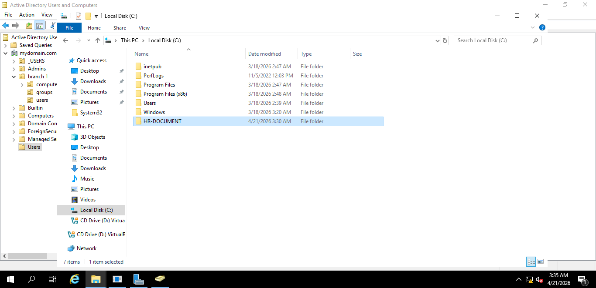
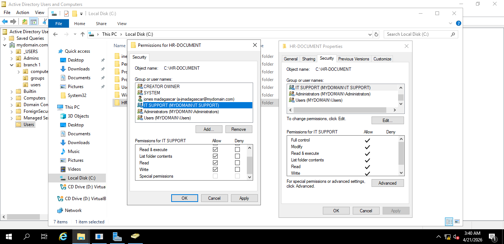

## 👋 About Me
I am an aspiring IT Support Technician with hands-on experience in:

- Active Directory (AD)
- Windows Server Administration
- Cisco Networking Basics
- ServiceNow Ticketing System
- Hardware troubleshooting and repair

This portfolio demonstrates practical IT support skills in real-world scenarios.

---

## 🧠 Skills Demonstrated

- User account creation and management (Active Directory)
- Group policies and permissions
- Windows Server setup and administration
- Basic networking using Cisco Packet Tracer
- IT ticket logging and resolution (ServiceNow simulation)
- Hardware diagnostics and troubleshooting

---

## 📂 Projects & Evidence

---

### 1. Active Directory Management

#### 📸 User Creation  
Created and managed user accounts in Active Directory.

---

#### 📸 Configure Account Details  
Configured user account details such as login settings and properties.

---

#### 📸 User Verification  
Confirmed that users are properly created and listed in the domain.

---

#### 📸 Organising Users into Security Groups  
Users were assigned to security groups in Active Directory to manage access permissions efficiently.

---

#### 📸 Adding User to Security Group  
Assigned a user account to the appropriate security group to manage access through group-based permissions.

---

#### 📸 Verifying Group Membership (Member Of Tab)  
Confirmed that the user is successfully added to the correct security group using the "Member Of" tab in Active Directory.

---

#### 📸 Creating a Shared Folder (C: Drive)  
Created a shared folder on the local drive to store and manage organizational files.

---

#### 📸 Assigning NTFS Permissions  
Configured NTFS permissions by assigning the security group to the shared folder, ensuring controlled access based on group membership.

