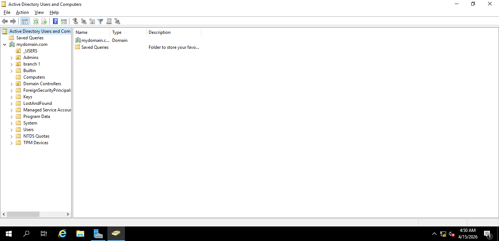

# IT Support Portfolio

## About Me

I am an aspiring IT Support Technician with hands-on experience in troubleshooting, networking, and system administration.

---

## Active Directory (AD) Lab

### What I Did

* Created and managed user accounts
* Organized users into groups
* Reset passwords and managed permissions
* Practiced real IT support tasks in a Windows Server environment

### Screenshot

### Screenshot

---

## Skills how to insert screenshots  step by step

---

## Skills

* Active Directory user management
* Windows Server basics
* Networking fundamentals (Cisco)
* Hardware troubleshooting
* Ticketing systems

---

## Goal

To become a skilled IT Support Technician by gaining real-world experience and improving my technical skills.
