## 👋 About Me
I am an aspiring IT Support Technician with hands-on experience in:

- Active Directory (AD)
- Windows Server 
- Cisco Networking Basics
- ServiceNow Ticketing System
- Hardware troubleshooting and repair

This portfolio demonstrates practical IT support skills in real-world scenarios.

---

## 🧠 Skills Demonstrated

- User account creation and management (Active Directory)
- Group policies and permissions
- Windows Server setup and administration
- Basic networking using Cisco Packet Tracer
- IT ticket logging and resolution (ServiceNow simulation)
- Hardware diagnostics and troubleshooting

---

## 📂 Projects & Evidence

---

### 1. Active Directory Management

#### 📸 User Creation  
Created and managed user accounts in Active Directory.

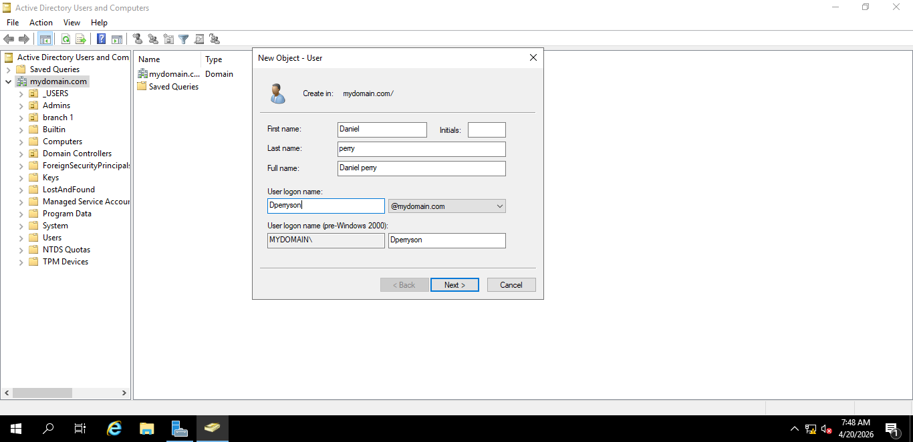

---

#### 📸 Configure Account Details  
Configured user account details such as login settings and properties.

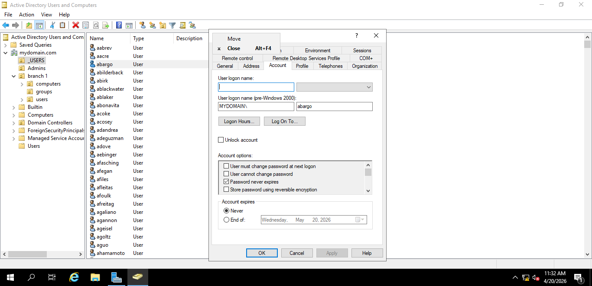

---

#### 📸 User Verification  
Confirmed that users are properly created and listed in the domain.

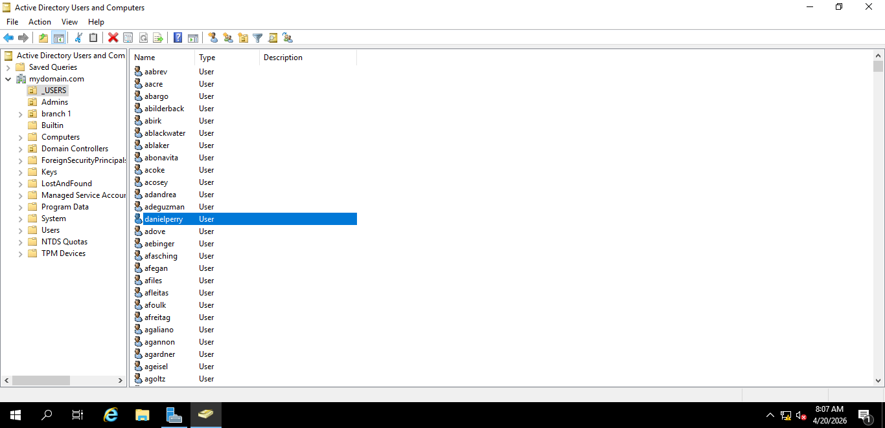

---

#### 📸 Organising Users into Security Groups  
Users were assigned to security groups in Active Directory to manage access permissions efficiently.

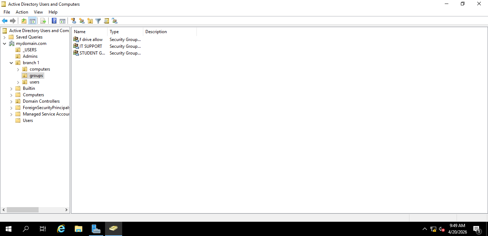

---

#### 📸 Adding User to Security Group  
Assigned a user account to the appropriate security group to manage access through group-based permissions.

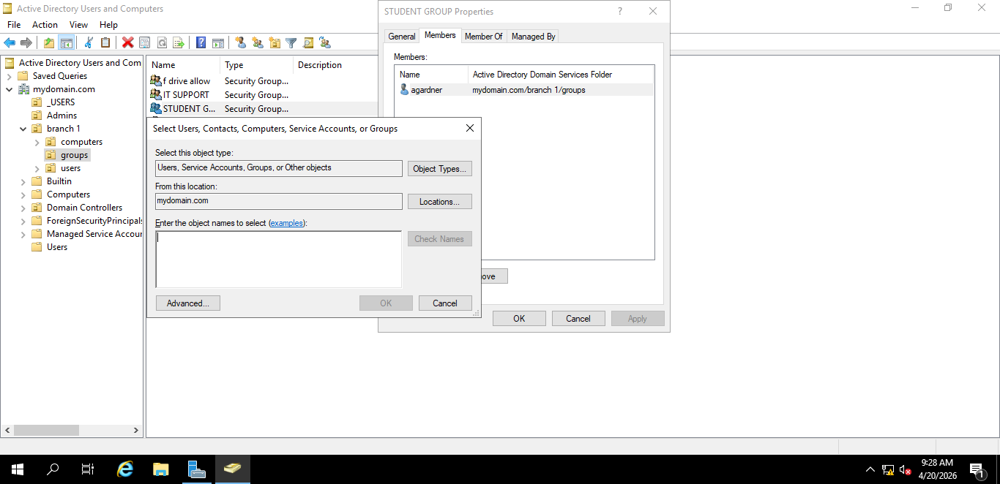

---

#### 📸 Verifying Group Membership (Member Of Tab)  
Confirmed that the user is successfully added to the correct security group using the "Member Of" tab in Active Directory.

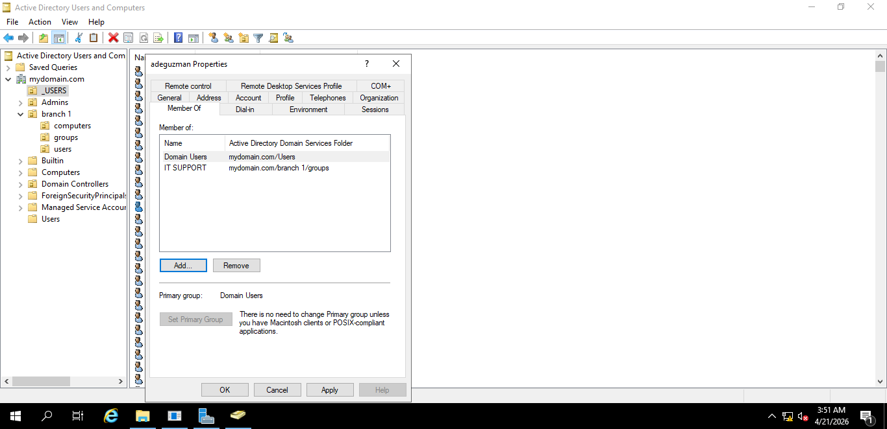

---

#### 📸 Group Policy Object (GPO) Implementation  
Created a new Group Policy Object (GPO) in Active Directory and named it "Password Policy".

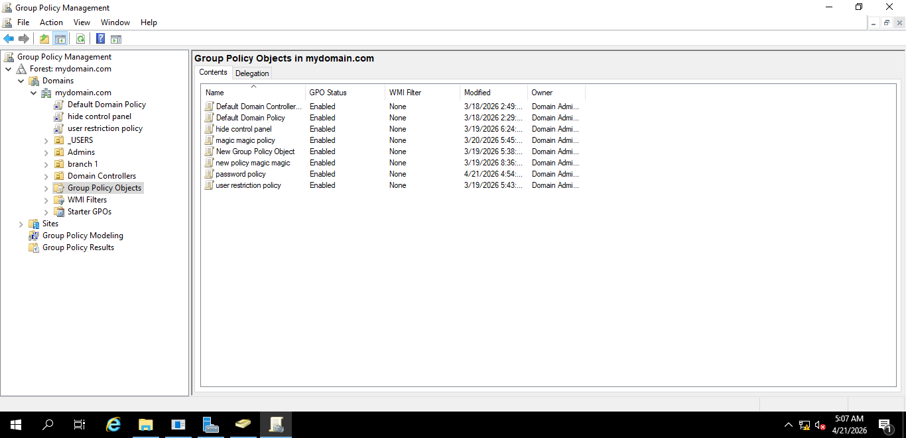

---

#### 📸 Linking the GPO to an Organizational Unit (OU)  
Linked the Group Policy Object (GPO) to the appropriate Organizational Unit (OU) to ensure the policy is applied to targeted users and computers.

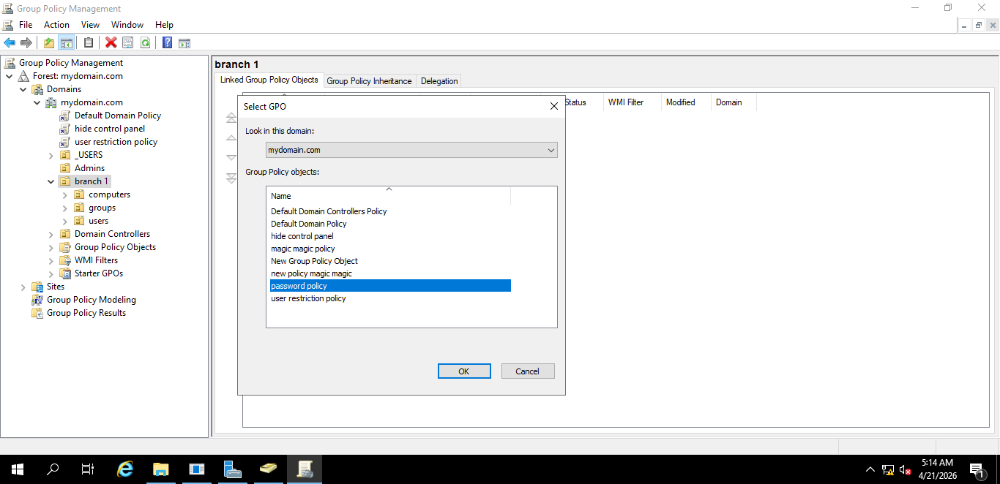

---

#### 📸 Editing the GPO  
Edited the Group Policy Object using the Group Policy Management Editor to configure security settings.

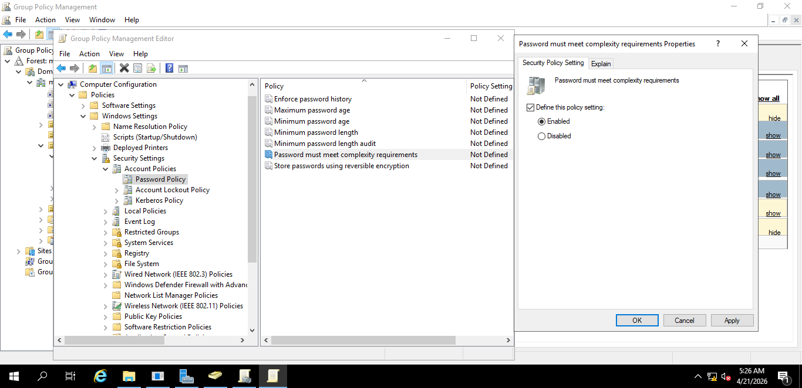

---

#### 📸 Configuring Security Settings  
Configured password policy settings, including enabling password complexity requirements to improve domain security.

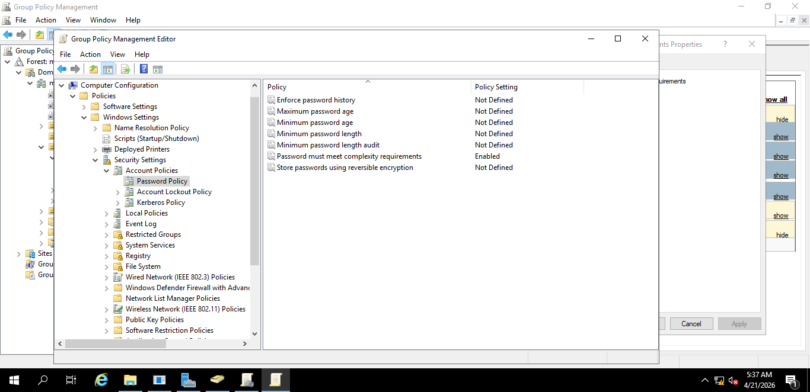

---

#### 📸 Applying Group Policy Update  
Applied the updated Group Policy settings using the `gpupdate /force` command on client machines to ensure immediate enforcement.

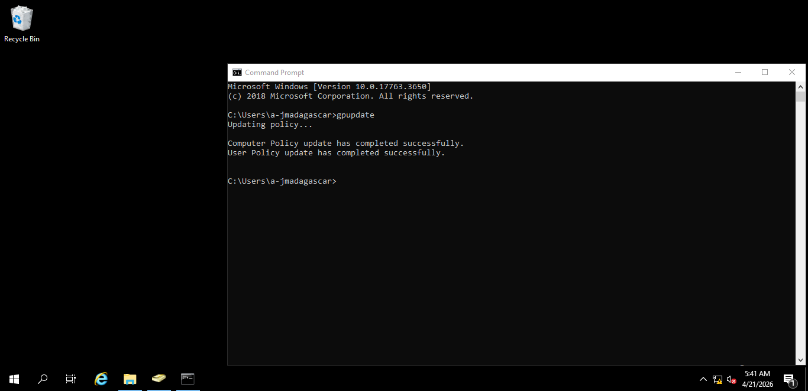

### 2. Windows Server Administration

#### 📸 Installed Windows Server
Installed and configured Windows Server environment for system administration.

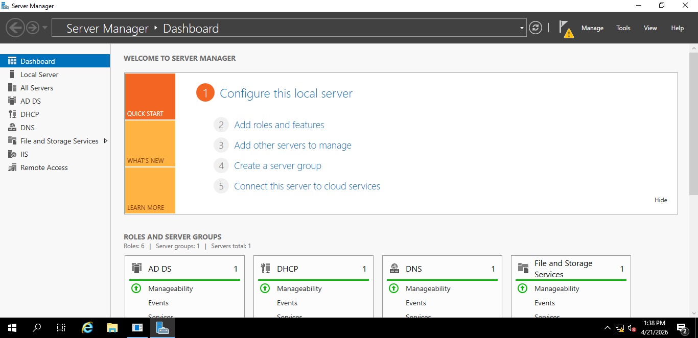

#### 📸 Installed Roles and Features
Installed Windows Server roles such as AD DS and DNS using Server Manager for domain and network services configuration.

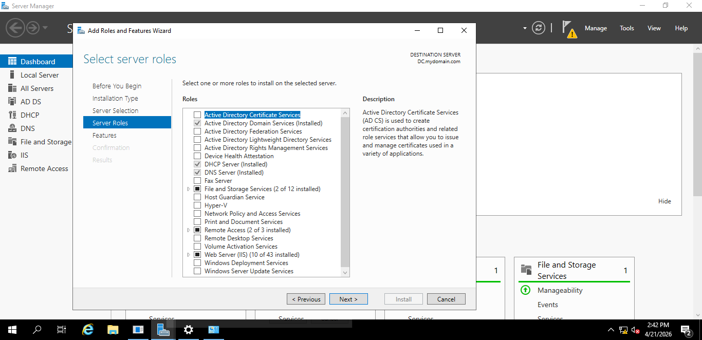

#### 📸 Network Configuration
Verified network settings including IP addresses and DNS configuration.

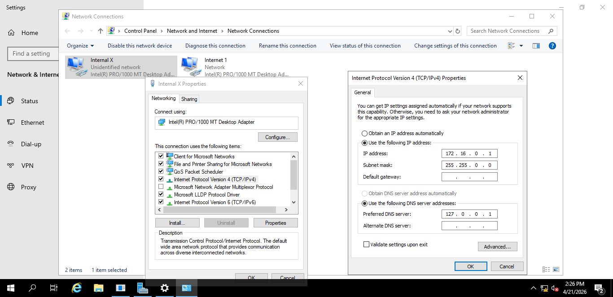

#### 📸 Domain Controller Configuration  
Configured the server as a domain controller and verified successful domain setup.

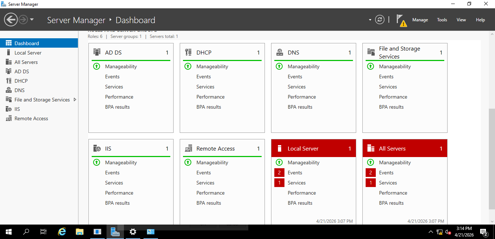

### 3.Cisco Packet tracer

#### 📸 Network Topology Setup  
Created a basic network topology using Cisco Packet Tracer including PCs, switches, and a router.

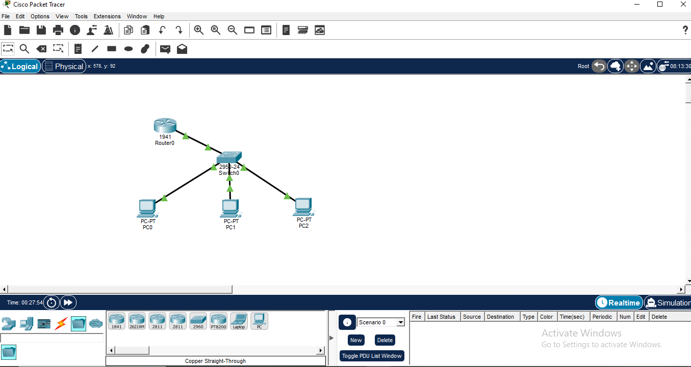

#### 📸 IP Address Configuration
Configured static IP addresses on end devices to enable network communication.

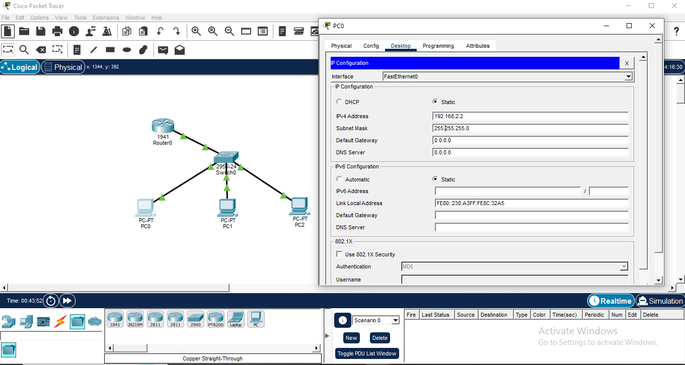

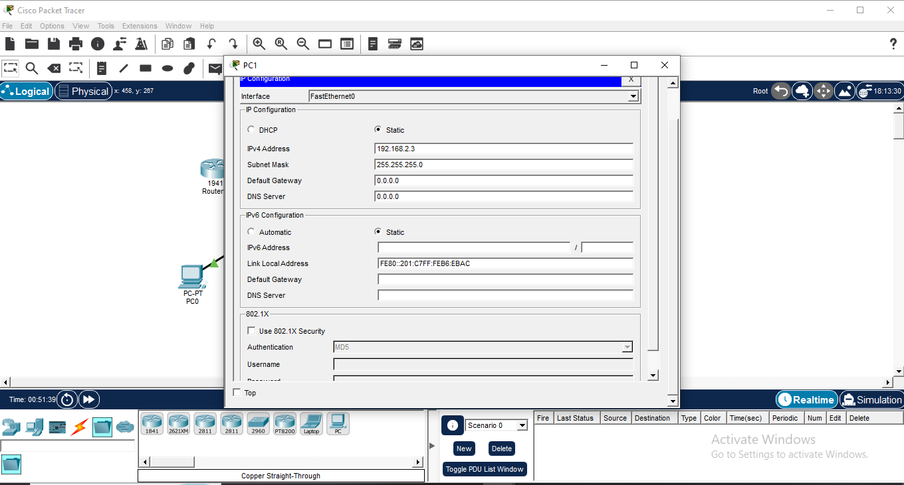
